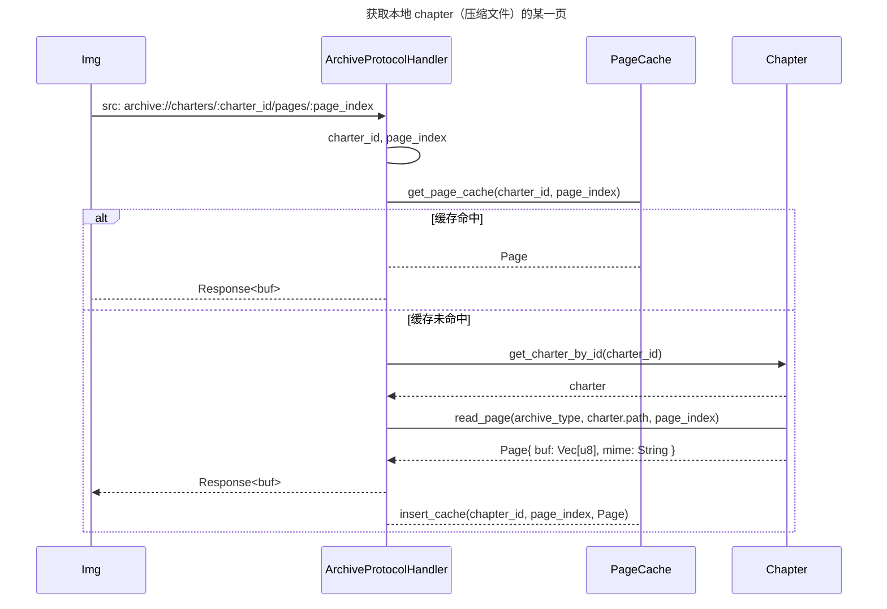

```mermaid
sequenceDiagram
  title 获取本地 chapter（压缩文件）的某一页
  participant Img
  participant ArchiveProtocolHandler
  participant PageCache
  participant Chapter

  Img->>ArchiveProtocolHandler: src: archive://charters/:charter_id/pages/:page_index
  ArchiveProtocolHandler->ArchiveProtocolHandler: charter_id, page_index
  ArchiveProtocolHandler->PageCache: get_page_cache(charter_id, page_index)
  alt 缓存命中
    PageCache-->ArchiveProtocolHandler: Page
    ArchiveProtocolHandler-->Img: Response<buf>
  else 缓存未命中
    ArchiveProtocolHandler->>Chapter: get_charter_by_id(charter_id)
    Chapter-->>ArchiveProtocolHandler: charter
    ArchiveProtocolHandler->Chapter: read_page(archive_type, charter.path, page_index)
    Chapter-->>ArchiveProtocolHandler: Page{ buf: Vec[u8], mime: String }
    ArchiveProtocolHandler-->>Img: Response<buf>
    ArchiveProtocolHandler-->PageCache: insert_cache(chapter_id, page_index, Page)
  end
```
