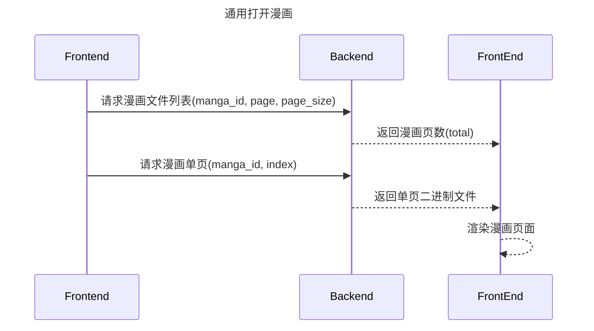

```mermaid
sequenceDiagram
  title 通用打开漫画
  participant Frontend
  participant Backend

  Frontend->>Backend: 请求漫画文件列表(manga_id, page, page_size)
  Backend-->>FrontEnd: 返回漫画页数(total)

  Frontend->>Backend: 请求漫画单页(manga_id, index)
  Backend-->>FrontEnd: 返回单页二进制文件
  FrontEnd-->>FrontEnd: 渲染漫画页面
```
